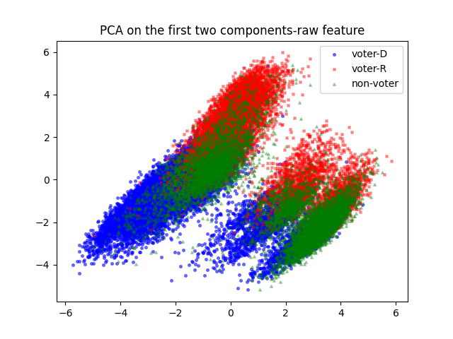
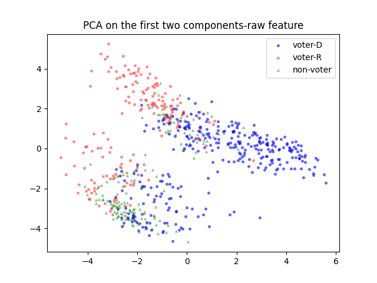
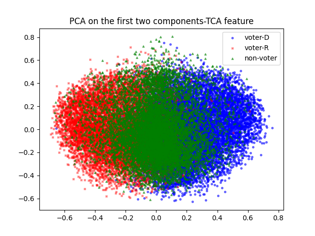
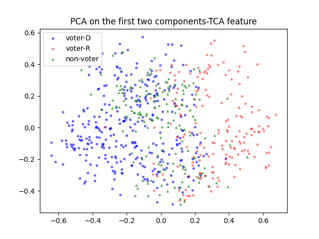

### Introduction
In our current study, we aim to solve the challenge of predicting voting behavior as a binary classification problem across different domains. The objective is to predict political voting behavior (Vote-D or Vote-R) using data from voter groups with known labels (source domain) and non-voter groups without labels (target domain). To achieve accurate predictions, we integrate several machine learning techniques to manage cross-domain data complexities and ensure effective knowledge transfer.

### Step 1: Initial Feature Selection and PCA Visualization
After selecting relevant features based on domain knowledge and missing ratios, we applied Principal Component Analysis (PCA) to visualize all voter samples (Vote-D and Vote-R) and non-voter samples using the first two principal components. This visualization serves several key purposes:

1. **Evaluating Feasibility and Distribution**: The PCA visualization helps us determine if samples from different domains are distinguishable and whether they follow similar distributions. Understanding this is crucial for assessing the challenges of applying a model trained on the source domain directly to the target domain.
2. **Simplifying Data Complexity**: By reducing the data to two dimensions, PCA allows us to clearly view the data structure and identify potential patterns that might not be visible in higher-dimensional spaces.

The visualization results are shown in Figure 1(whole samples) and Figure 2(samples in WA).

*Figure1: PCA on the first two components-raw feature(all samples)*

*Figure2: PCA on the first two components-raw feature(samples in WA)*

In Figure 1 and 2, the red points represent Vote-R samples, blue points represent Vote-D samples, and green points represent non-voter samples. 

### Step 2: Insights and Model Selection
From the PCA results, several insights can be drawn:

1. **Clear Separation Between Vote-D and Vote-R**: The classification boundary between Vote-D and Vote-R (red and blue points in the PCA) is relatively clear, indicating that these two groups are separable. The green non-voter points are mainly located at the boundary between the two classes. This suggests that using Logistic Regression with Elastic Net Regularization is a viable approach for our universal prediction model.
2. **Distribution Differences Between Voter and Non-voter Groups**: The PCA results also reveal that the non-voter group (green points) has a more concentrated distribution compared to the voter group (red and blue points). This indicates that there might be bias when applying a model trained on voter data to non-voter data.

### Step 3: Mitigating Domain Shift with TCA
To address the distribution differences and potential bias identified in Step 2, we employed Transfer Component Analysis (TCA) to map both voter and non-voter samples into a shared domain. TCA helps align the feature spaces of the source and target domains, thereby reducing domain shift.

#### TCA Methodology
1. **Kernel Mapping**: TCA maps the original data points from both domains into a higher-dimensional feature space using a kernel function. This helps capture non-linear relationships between features, which is crucial for domain alignment.
2. **Learning a Shared Subspace**: In the higher-dimensional space, TCA identifies the most informative directions (components) that reduce the distribution disparity between the two domains. This is done by maximizing the similarity of source and target data distributions in the new subspace.
3. **Dimensionality Reduction**: TCA projects the data onto these learned components, reducing dimensionality while focusing on the most relevant features for both domains.

We visualized the samples after TCA feature transformation using PCA in Figure 3 (all samples)  and 4(samples in WA)

*Figure3: PCA on the first two components-TCA feature(all samples)*

*Figure4: PCA on the first two components-TCA feature(samples in WA)*

In Figure 3 and 4, the red points represent Vote-D samples, blue points represent Vote-R samples, and green points represent non-voter samples. The visualization shows that the heterogeneity between voter and non-voter samples is significantly improved. 

### Conclusion
Our methodology effectively combines PCA, logistic regression with elastic net regularization, and TCA to tackle the challenges of cross-domain binary classification. Each step is designed to address specific issues related to distribution disparity and feature alignment, enhancing the overall prediction accuracy of the model across different domains. By strategically integrating these techniques, we create a robust framework for predicting voting behavior in politically diverse settings. This approach ensures that our model not only predicts accurately but also adapts effectively to different data distributions.